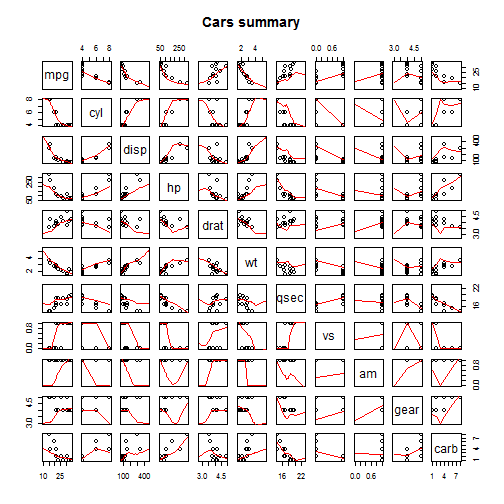
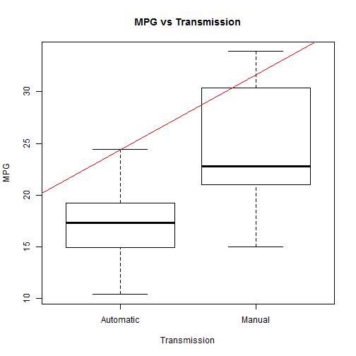
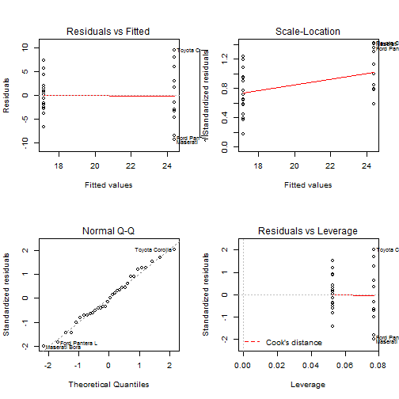

# How transmission affects the car's fuel consumption
========================================================

## Executive summary
We are interested in two question: "Is an automatic or manual transmission better for MPG?" and "Quantifying how different is the MPG between automatic and manual transmissions?" 
The answers based on the mtcars dataset what is from 1974 Motor Trend US magazine. 
I used some basic data wrangling and regression models to answer the questions. 


### Loading the dataset

```r
data(mtcars)
```
### Description for the mtcars dataset

```r
?mtcars
```

```
## starting httpd help server ... done
```
### Converting transmission values to factors

```r
cars<-transform(mtcars, am=factor(am))
levels(cars$am)[1] <- "Automatic"
levels(cars$am)[2] <- "Manual"
```
### Calculating the mean of each transmission types

```r
mean(cars$mpg[cars$am=="Automatic"])
```

```
## [1] 17.15
```

```r
mean(cars$mpg[cars$am=="Manual"])
```

```
## [1] 24.39
```
### Regression model for transmission type how affect the car's fuel consumption

```r
fit1 <- lm(mpg~am, data=mtcars)
summary(fit1)
```

```
## 
## Call:
## lm(formula = mpg ~ am, data = mtcars)
## 
## Residuals:
##    Min     1Q Median     3Q    Max 
## -9.392 -3.092 -0.297  3.244  9.508 
## 
## Coefficients:
##             Estimate Std. Error t value Pr(>|t|)    
## (Intercept)    17.15       1.12   15.25  1.1e-15 ***
## am              7.24       1.76    4.11  0.00029 ***
## ---
## Signif. codes:  0 '***' 0.001 '**' 0.01 '*' 0.05 '.' 0.1 ' ' 1
## 
## Residual standard error: 4.9 on 30 degrees of freedom
## Multiple R-squared:  0.36,	Adjusted R-squared:  0.338 
## F-statistic: 16.9 on 1 and 30 DF,  p-value: 0.000285
```

```r
coef(fit1)
```

```
## (Intercept)          am 
##      17.147       7.245
```
### AIC for the best model

```r
fit2 <- step(lm(mpg ~ ., data=cars), direction="both", k=3, trace=0)
summary(fit2)
```

```
## 
## Call:
## lm(formula = mpg ~ wt + qsec + am, data = cars)
## 
## Residuals:
##    Min     1Q Median     3Q    Max 
## -3.481 -1.556 -0.726  1.411  4.661 
## 
## Coefficients:
##             Estimate Std. Error t value Pr(>|t|)    
## (Intercept)    9.618      6.960    1.38  0.17792    
## wt            -3.917      0.711   -5.51    7e-06 ***
## qsec           1.226      0.289    4.25  0.00022 ***
## amManual       2.936      1.411    2.08  0.04672 *  
## ---
## Signif. codes:  0 '***' 0.001 '**' 0.01 '*' 0.05 '.' 0.1 ' ' 1
## 
## Residual standard error: 2.46 on 28 degrees of freedom
## Multiple R-squared:  0.85,	Adjusted R-squared:  0.834 
## F-statistic: 52.7 on 3 and 28 DF,  p-value: 1.21e-11
```

```r
coef(fit2)
```

```
## (Intercept)          wt        qsec    amManual 
##       9.618      -3.917       1.226       2.936
```
### Comparing models

```r
anova(fit1,fit2)
```

```
## Analysis of Variance Table
## 
## Model 1: mpg ~ am
## Model 2: mpg ~ wt + qsec + am
##   Res.Df RSS Df Sum of Sq    F  Pr(>F)    
## 1     30 721                              
## 2     28 169  2       552 45.6 1.6e-09 ***
## ---
## Signif. codes:  0 '***' 0.001 '**' 0.01 '*' 0.05 '.' 0.1 ' ' 1
```

## Appendix

### Figure 1

```r
pairs(mtcars, panel=panel.smooth, main="Cars summary",col=mtcars$am)
```

 

### Figure 2

```r
plot(cars$am , cars$mpg, main="MPG vs Transmission", xlab="Transmission", ylab="MPG", )
abline(lm(mpg ~ am, cars), col="red")
```

 

### Figure 3

```r
layout(matrix(c(1,2,3,4),2,2))
plot(fit2)
```

 


